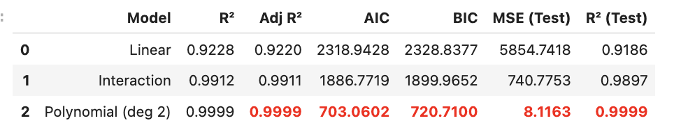
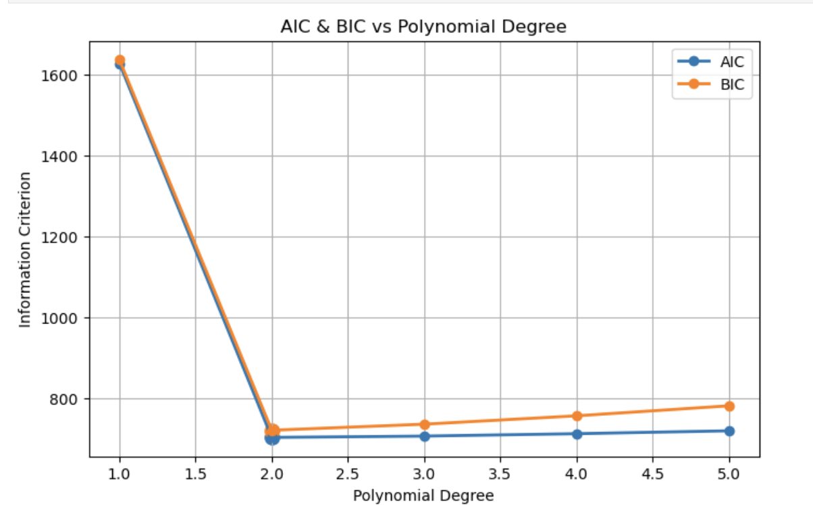
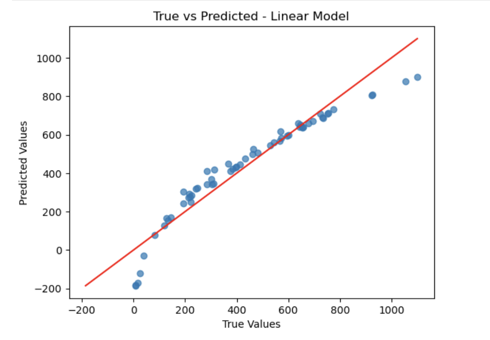
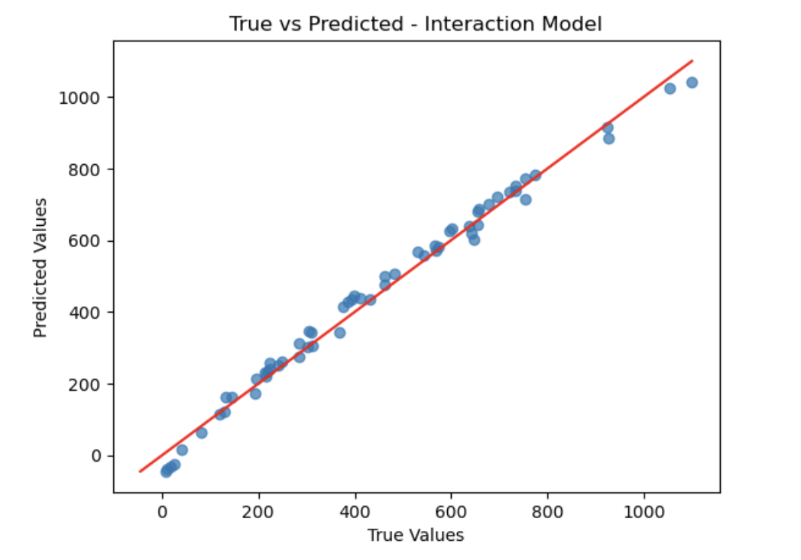
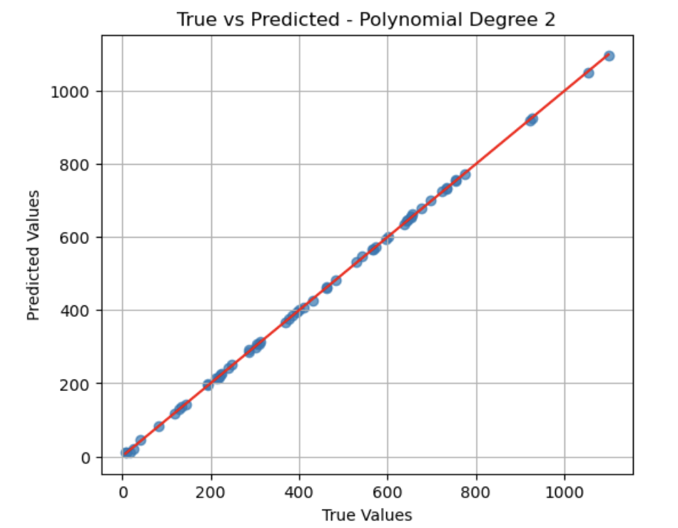
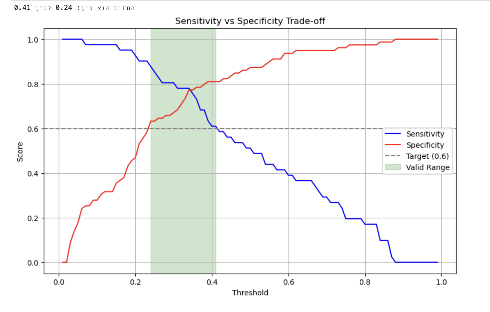
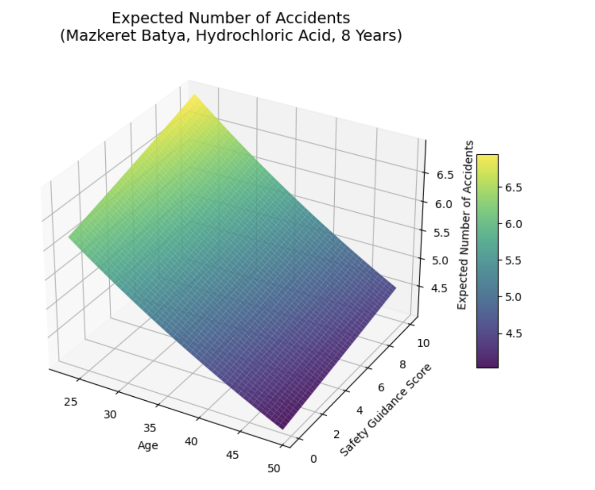
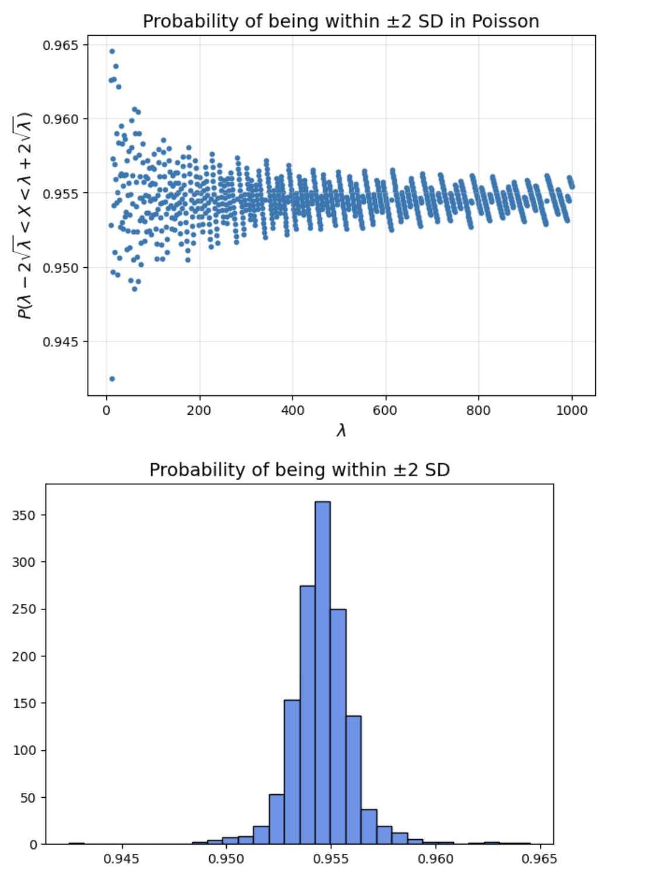
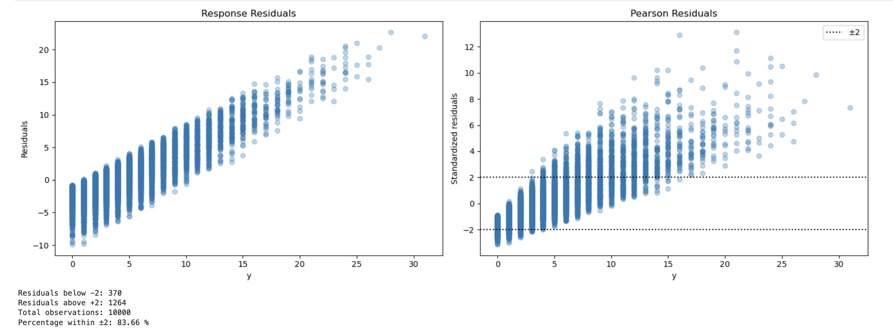
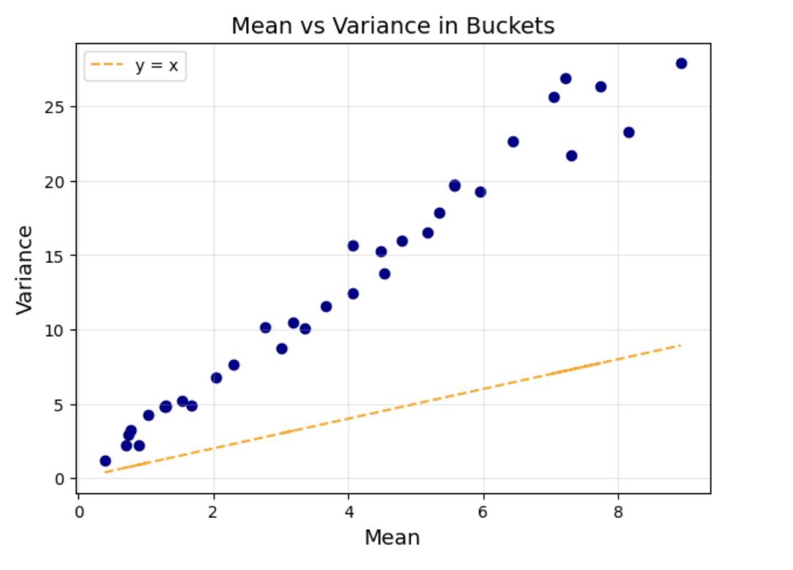

# Regression Models Analysis

This project explores several statistical regression models and compares how different models describe the same data.

The project includes two notebooks and investigates multiple regression approaches:

• Linear Regression  
• Polynomial Regression  
• Logistic Regression  
• Poisson Regression  
• Negative Binomial concepts

The goal is to understand how model assumptions influence predictions and model performance.

---

# Project Structure

Linear&polynomial.ipynb
Logistic&Poisson&Binomial.ipynb

Each notebook focuses on a different modeling approach and includes model building, evaluation, and visualization.

---

# Project 1 — Linear, Interaction and Polynomial Regression

This project analyzes how different regression models perform when predicting a continuous outcome.

The following models were compared:

• Linear Regression  
• Linear Regression with Interaction Terms  
• Polynomial Regression

---

## Model Comparison

The comparison shows that the **Polynomial Regression model (degree 2)** achieved the best performance based on:

• Highest R²  
• Lowest AIC and BIC  
• Lowest test MSE

---

## Model Selection Using AIC and BIC

The information criteria indicate that **Polynomial Degree 2** provides the best trade-off between model accuracy and complexity.

---

## Linear Regression

Linear regression assumes a simple linear relationship between predictors and the response variable.

---

## Interaction Model

Adding interaction terms allows the model to capture relationships between variables.

---

## Polynomial Regression

Polynomial regression captures nonlinear patterns in the data and significantly improves model accuracy.

---

# Project 2 — Logistic Regression

Logistic regression is used for classification problems where the response variable represents probability.

The model estimates the probability of an event and evaluates classification thresholds.

---

## Sensitivity vs Specificity Trade-off

This graph illustrates how sensitivity and specificity change across different classification thresholds.

A valid range of thresholds balances both measures.

---

# Project 3 — Poisson Regression and Count Data Analysis

This project analyzes count data and investigates the properties of the Poisson distribution.

Poisson regression is commonly used to model:

• number of events  
• accident counts  
• occurrences over time

---

## Expected Number of Events (Poisson Surface)

The surface illustrates how predictors influence the expected number of events.

---

## Probability within ±2 Standard Deviations

The probability distribution converges around a stable range as λ increases.

---

## Residual Diagnostics

Residual analysis helps identify deviations from model assumptions.

---

## Mean vs Variance Analysis

For a theoretical Poisson distribution:

The following visualization evaluates whether the data follows this property.

When variance exceeds the mean, **over-dispersion** may occur and alternative models such as **Negative Binomial regression** may be required.

---

# Technologies Used

Python  
Pandas  
NumPy  
Statsmodels  
Scikit-learn  
Matplotlib  
Seaborn  
Jupyter Notebook

---

# Key Insights

Different regression models are suited for different types of data:

• Linear models describe continuous relationships  
• Logistic models estimate probabilities for classification  
• Poisson models describe count processes  

Selecting the correct statistical model is essential for producing reliable predictions and meaningful insights.

